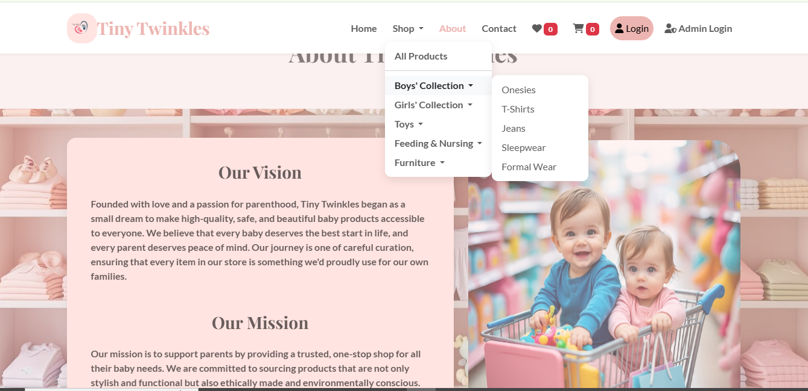
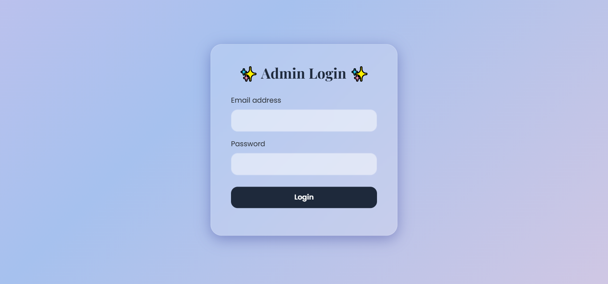
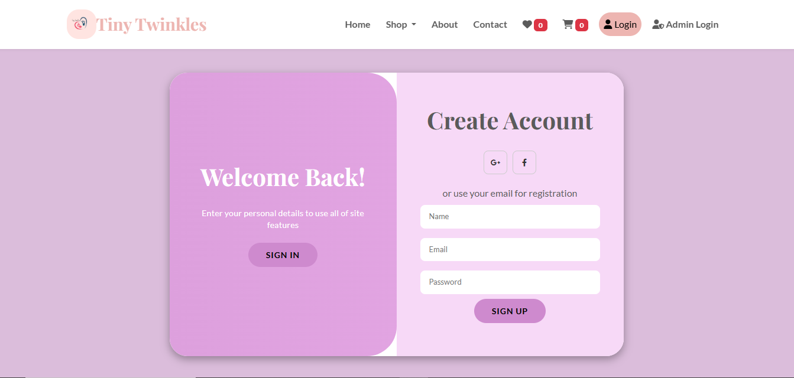
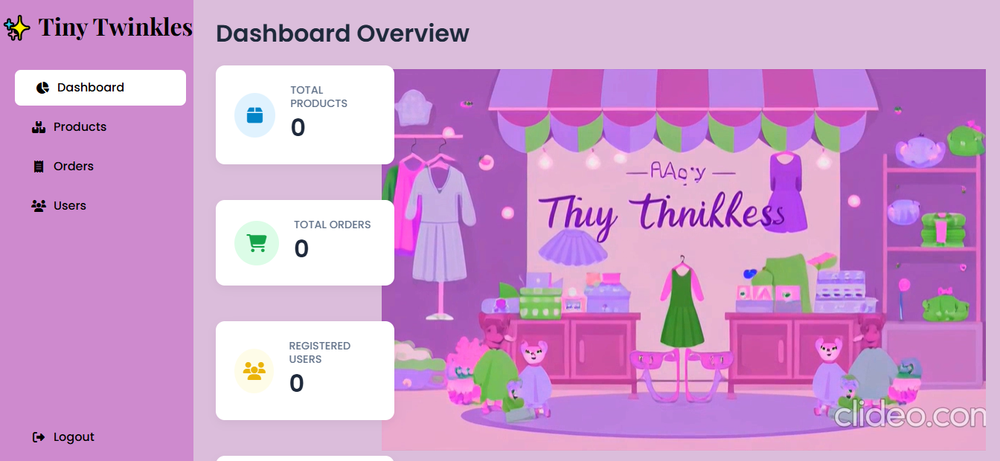

# 👶 Tiny Twinkles - Online Baby Shopping System

Tiny Twinkles is a modern and responsive Online Baby Shopping System that provides parents with a convenient platform to browse, wishlist, and purchase baby products. The application offers an intuitive shopping experience with organized product categories, shopping cart management, secure authentication, and checkout functionality.

---

## 📌 Project Overview

Tiny Twinkles is designed to simplify online shopping for baby essentials. The website features a clean and attractive user interface, allowing customers to explore various baby products such as clothing, toys, feeding accessories, and furniture.

The project is developed using front-end web technologies and demonstrates the implementation of a complete e-commerce interface.

---

## ✨ Features

- 🏠 Responsive Home Page
- 🛍️ Product Categories
  - Boys Collection
  - Girls Collection
  - Toys
  - Feeding & Nursing
  - Furniture
- ❤️ Wishlist Management
- 🛒 Shopping Cart
- 👤 User Registration & Login
- 📦 Checkout Process
- ✅ Order Confirmation
- 📱 Mobile Responsive Design
- 🎠 Hero Image Carousel
- 🔍 Product Details Modal
- 📏 Product Size Selection
- 🔐 Admin Login Page
- 📞 Contact Page
- ℹ️ About Us Page

---

## 🖥️ Technologies Used

| Technology | Purpose |
|------------|----------|
| HTML5 | Structure |
| CSS3 | Styling |
| JavaScript (ES6) | Client-side Functionality |
| Bootstrap 5 | Responsive UI |
| Font Awesome | Icons |
| Google Fonts | Typography |

---

## 📂 Project Structure

```
Tiny-Twinkles/
│
├── backend_api/
│   ├── db_connector.py
│   ├── server.py
├── database/
│   ├── tiny_twinkles.sql
├── frontend/
│   ├── allproduct/
│     ├── boy
│     ├── feed
│     ├── fur
│     ├── girl
│     ├── toys
│     ├── server.py
├── images/
│   ├── images(1.jpg-80.jpg)
├── admin-login.html
├── admin.html
├── index.html
├── script.js
├── style.css│
└── README.md
```

---

## 📸 Website Modules

### 🏠 Home
- Hero Slider
- Featured Products

### 🛍️ Shop
- All Products
- Boys Collection
- Girls Collection
- Toys
- Feeding & Nursing
- Furniture

### ❤️ Wishlist
- Save favorite products
- Remove products

### 🛒 Cart
- Add products
- Remove products
- Quantity Management
- Total Price Calculation

### 👤 Authentication
- User Registration
- User Login

### 💳 Checkout
- Order Summary
- Place Order
- Order Confirmation

### 🔐 Admin
- Separate Admin Login Page

---

## 🚀 How to Run

1. Clone the repository

```bash
git clone https://github.com/indra-institute-of-education/student-002-Online-baby-shopping-platform
```

2. Navigate to the project

```bash
cd student-002-Online-baby-shopping-platform
```

3. Open

```
index.html
```

using any modern web browser.

No installation is required.

---

## 🎯 Future Enhancements

- Backend Integration
- Database Connectivity
- Online Payment Gateway
- Product Search
- Product Reviews
- Order Tracking
- User Profile Management
- Email Notifications
- Admin Dashboard
- Inventory Management

---

## 📸 Project Screenshots

| Home | Products |
|------|----------|
|  |  |

| AdminLogin | UserLogin |
|-----------|------|
|  |  |

| Admin Dashboard |
|-----------|
|  |


## ⭐ Support

If you found this project helpful, don't forget to **Star ⭐ the repository**.
